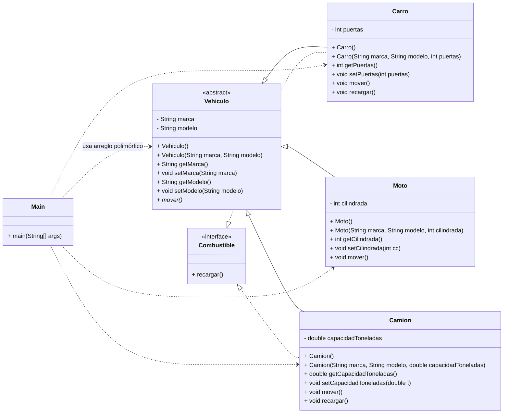

```mermaid
classDiagram
  direction LR

  class Vehiculo {
    <<abstract>>
    - String marca
    - String modelo
    + Vehiculo()
    + Vehiculo(String marca, String modelo)
    + String getMarca()
    + void setMarca(String marca)
    + String getModelo()
    + void setModelo(String modelo)
    + mover()*
  }

  class Combustible {
    <<interface>>
    + recargar()
  }

  class Carro {
    - int puertas
    + Carro()
    + Carro(String marca, String modelo, int puertas)
    + int getPuertas()
    + void setPuertas(int puertas)
    + void mover()
    + void recargar()
  }

  class Moto {
    - int cilindrada
    + Moto()
    + Moto(String marca, String modelo, int cilindrada)
    + int getCilindrada()
    + void setCilindrada(int cc)
    + void mover()
  }

  class Camion {
    - double capacidadToneladas
    + Camion()
    + Camion(String marca, String modelo, double capacidadToneladas)
    + double getCapacidadToneladas()
    + void setCapacidadToneladas(double t)
    + void mover()
    + void recargar()
  }

  class Main {
    + main(String[] args)
  }

  Vehiculo <|-- Carro
  Vehiculo <|-- Moto
  Vehiculo <|-- Camion

  Combustible <|.. Carro
  Combustible <|.. Camion

  Main ..> Vehiculo : usa arreglo polimórfico
  Main ..> Carro
  Main ..> Moto
  Main ..> Camion
```
